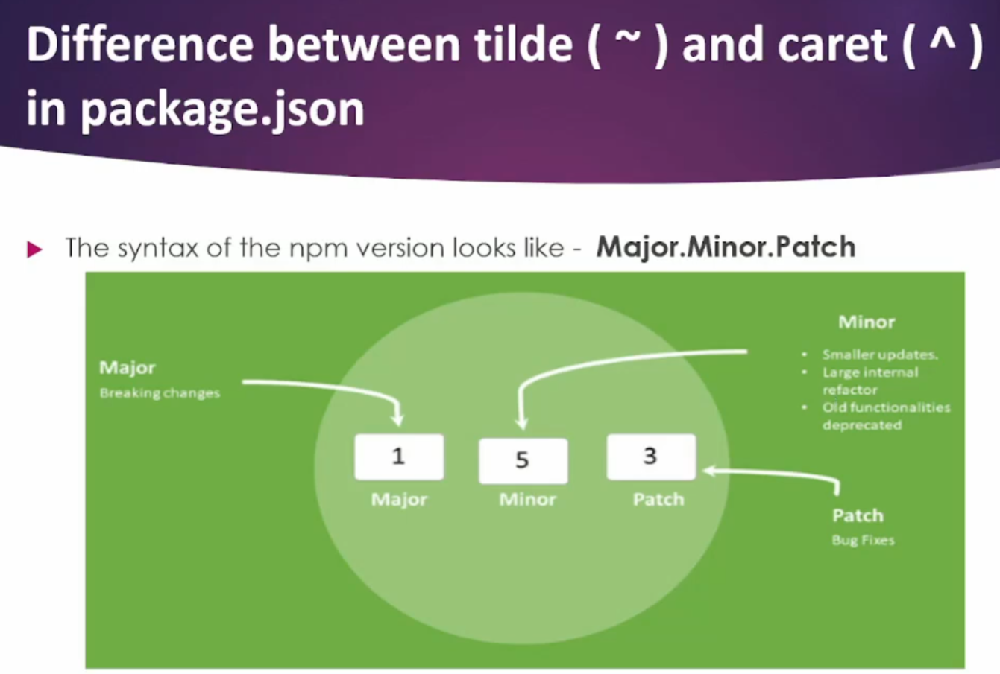

# Namaste React 🚀
# diving deep into code
# diving deep into technical concepts


## What is CDN in React?
- React is integrated in the projects using package managers like npm or yarn. However, there are some cases where using Content Delivery Network (CDN) links can be a advantage, especially for quick prototypes, or when integrating React into existing projects.

## There were two way to get react in our project
- 1. By using cdn link and 
- 2. via npm


- At the end of the day react is a javascript package and it is hosted over npm also


- But CDN is not a prefer way to bring react and react DOM in project why because fetching from cdn is costly operation it will network call to unpkg.com and it will get react from there
- But if we have already React in node_modules it would it be easy, we dont have to another network call to React. We will have already in our node_modules

inserting react in our projects

```
<script crossorigin src="https://unpkg.com/react@18/umd/react.development.js"></script>
<script crossorigin src="https://unpkg.com/react-dom@18/umd/react-dom.development.js"></script>
```
- This is how we can include react in our project using CDN link
## Now we have super power of react inside it

## To become a great software developer - be curious about every small damn things.
- what is cdn , why are we using cdn , is there a different way to do it (these type of questions should arise to be a great software developer)


## We as a developer have to use this super power to build the large scale applications.
- We have to use this super power to build the scalable, maintainable, and efficient applications.
- We are going to use this super power into our project, we are going to do that a better a good react developer is the one who knows how to use the super power (react cdn)


## what is the most costly expensive operation in web browser? 
* Layout and Reflow: when you modify the DOM, change CSS styles, or resize the window
* DOM Manipulation: when inserting or removing elements
* CSS Selectors:CSS Selectors: Using complex CSS selectors, such as those with multiple classes, IDs, and pseudo-classesUsing complex CSS selectors, such as those with multiple classes, IDs, and pseudo-classes
* One word answer : When DOM nodes manipulate when you click the button and something shows and hide the DOM Tree getting changed putting some nodes in the DOM and removing inside the DOM is the most expensive operation in web browser

```
const parent2 = React.createElement("div", {className: "grandparentc"},
    React.createElement("div",{id: "parentid"},[
        React.createElement("div", {id: "childid"},[
            React.createElement("h1", {}, "I am tag inside the class"),
            // if we wish to add sibling
            React.createElement("h2",{id:"h2sibling"}, "I am sibling using array"),
        ]),
        
        React.createElement("div", {id: "childid2"}, [
            React.createElement("h2", {}, "I am h2 tag inside childid2"),
            React.createElement("h1", {}, "I am h1 tag inside childid2 "),
        ]),
    ])
);
```

* Only this much is react to avoid messy code we use JSX
- JSX makes life easy when we have to create tags

* ReactElement(Object) => HTML(Browser Understands)

===========================================================
- What ever we written in index.html it will start executing from top to bottom it will execute react then react DOM and at the end it will see App.js and it went to that file and root.render() and it will see what is root it is taking the div with id root and it will render the App.js inside that div and what ever written inside the div it will replace not append (<div id="root">Om is here </div>) om is here will be replaced.

## Namaste React 
# _Episode 01 - Inception_

## Q: What is `Emmet`?

A: `Emmet` is the essential toolkit for web-developers. It allows you to `type shortcuts` that are then expanded into full pieces of code for writing `HTML and CSS`, based on an abbreviation structure most developers already use that expands into full-fledged HTML markup and CSS rules.

## Q: What is `CDN`? Why do we use it?

A: A `content delivery network (CDN)` refers to a geographically distributed group of servers that work together to provide fast delivery of Internet content.
The goal is to provide high availability and performance by distributing the service spatially relative to end users.

## Q: Why is `React known as React`?

A: And it's called `React` because it `reacts`. It was developed by Facebook (a site that CONSTANTLY updates their data) to improve the user interface development and more effectively change (REACT to) what the user sees when they're doing things like mouse clicking, submitting and typing.

## Q: What is `crossorigin in script tag`?

A: The `crossorigin` attribute sets the mode of the request to an HTTP CORS Request.
The purpose of crossorigin attribute is used to share the resources from one domain to another domain. Basically, it is used to handle the CORS request. It is used to handle the CORS request that checks whether it is safe to allow for sharing the resources from other domains.

### _Syntax_

```sh
<script crossorigin="anonymous|use-credentials">
```

## Q: What is difference between `React and ReactDOM`?

A: `React` is a JavaScript library for building User Interfaces whereas `ReactDOM` is also JavaScript library that allows `React to interact with the DOM`.

The react package contains `React.createElement()`, `React.Component`, `React.Children`, and other helpers related to elements and component classes. You can think of these as the isomorphic or universal helpers that you need to build components. The react-dom package contains `ReactDOM.render()`, and in react-dom/server we have server-side rendering support with `ReactDOMServer.renderToString()` and `ReactDOMServer.renderToStaticMarkup()`.

## Q: What is difference between `react.development.js` and `react.production.js` files via `CDN`?

A: `Development` is the stage of an application before it's made public while `production` is the term used for the same application when it's made `public`.
`Development build` is several times (maybe 3-5x) `slower` than the `production build`.

## Q: What are `async and differ` attributes in `<script>` tag?

A: `Async` - The async attribute is a `boolean attribute`. The script is downloaded in `parallel(in the background)` to parsing the page, and `executed as soon` as it is available (do not block HTML DOM construction during downloading process) and don’t wait for anything.

### _Syntax_

```
<script async src="demo_async.js"></script>
```

`Defer` - The defer attribute is a `boolean attribute`. The script is downloaded in `parallel(in the background)` to parsing the page, and `executed after the page` has finished parsing(when browser finished DOM construction). The `defer attribute` tells the browser `not to wait for the script`. Instead, the browser will continue to process the HTML, build DOM.

### _Syntax_

```sh
<script defer src="demo_defer.js"></script>
```

## Q: Difference between a `Library and Framework`?

A: A framework is a set of pre-written code that provides a structure for developing software applications. A library, on the other hand, is a collection of pre-written code that can be used to perform specific tasks.

A `library` is a collection of packages that perform specific operations whereas a `framework` contains the basic flow and architecture of an application. The major difference between them is the complexity. Libraries contain a number of methods that a developer can just call whenever they write code. React js is library and Angular is Framework.

The `framework` provides the flow of a software application and tells the developer what it needs and calls the code provided by the developer as required. If a `library` is used, the application calls the code from the library.

## References:

- https://beta.reactjs.org/apis/react/createElement
- https://www.youtube.com/watch?v=IrHmpdORLu8

---
## Namaste React 

# _Episode 02 - Igniting Our App_
 
- [Github](https://github.com/omprakash524/Namaste-react)

- npm is package management it will manage all the package and sometimes we also called dependencies (but not node package manager)

## Add node package manager to our project
- npm init
    - In our Project we will get package.json (configuration of project)
    - When we creating a react app behind the scence webpack as a bundlers
- npm install -D parcel
- npm install (To recreate node_modules if it deleted)
- npx parcel index.html (To run app)
- npm install react (To install react in our project)
- npm install react-dom (To install react-dom in our project)

- If you delete dist folder you can recreate build
- npx parcel build index.html

```git init```
package.json is a crucial configuration file for npm

- The most important package in our project is bundlers
- We use Webpack to bundle our code into a single file that can be executed by the browser
- Webpack, Parcel, and Vite are popular JavaScript bundlers and build tools, each with its own strengths

- Bundlers basically bundles the app it packages the app properly so that it can shipped to production.

## Here is a list of popular JavaScript module bundlers mentioned across different sources:

- Webpack: One of the most popular and highly configurable bundlers.
- Parcel: Known for its zero-configuration approach and speed.
- Rollup: Often used for libraries, focusing on ES modules.
- Vite: Known for its fast development server and optimized build process.
- Snowpack: An alternative to Webpack that uses a different approach to bundling.
- Browserify: One of the earlier bundlers focused on making node modules work in the browser.
These bundlers help in optimizing and packaging your code for production.


## There are two types of dependencies or packages we can install
- 1. dev dependencies - it is generally required for development phase
- 2. normal dependencies - used in production also


## Development dependencies in a Node.js project are packages required only during the development phase but not needed in the production environment. Here are some common examples:

- Webpack: A module bundler for JavaScript applications.
- Babel: A JavaScript compiler that allows you to use next-generation JavaScript today.
- ESLint: A tool for identifying and fixing problems in JavaScript code.
- Jest: A testing framework for JavaScript.
- Mocha: A feature-rich JavaScript test framework.
- Chai: An assertion library for Node.js and browsers.
- TypeScript: A typed superset of JavaScript that compiles to plain JavaScript.
- Prettier: An opinionated code formatter.
- React Testing Library: For testing React components.
- PostCSS: A tool for transforming CSS with JavaScript plugins.
These packages are typically listed under the devDependencies section in your package.json file 


## 

In Node.js and npm, there are several types of dependencies you can install, typically classified into the following categories:

## Production Dependencies: 
- Required for the application to run in production. They are specified under the dependencies section in package.json.

## Development Dependencies: 
- Needed only during development, such as testing libraries or build tools. These are specified under the devDependencies section.

## Peer Dependencies: 
- Specify which versions of a dependency are compatible with your package, allowing you to avoid version conflicts.

## Optional Dependencies: 
- These are not mandatory for your package to work, and you can specify fallback logic if they are not installed.

## Bundled Dependencies: 
- Include dependencies within your package, ensuring that they are installed when your package is installed [1][3].

In summary, there are five main types of dependencies you can install in a Node.js project.


- we will install package bundlers that is parcel which will be dev dependencies
- npm install -D parcel
- if our app is skeletion then parcel give muscles, parcel is beast

- "parcel": "^2.12.0"
= we can see caret(^) before version but we can also written tilde(~)

## Caret (^)
- The caret allows you to update a package to any version that is compatible with the specified version, while ensuring that no breaking changes are introduced.
- If you specify "^2.12.0":
It means you can update to any version from 2.12.0 up to, but not including, 3.0.0. This includes:
Patch versions (e.g., 2.12.1, 2.12.2, etc.)
Minor versions (e.g., 2.13.0, 2.14.0, etc.)
This is useful because it allows you to receive updates for bug fixes and new features that do not break existing functionality.

## Tilde (~)
- The tilde allows for more restricted updates. It limits updates to the patch version only.
- If you specify "~2.12.0":
It means you can update to any version from 2.12.0 up to, but not including, 2.13.0. This includes:
Only patch versions (e.g., 2.12.1, 2.12.2, etc.)
This is useful when you want to ensure that no new features (which could potentially introduce breaking changes) are added, focusing solely on small fixes.
## Summary
Use ^ when you are okay with receiving minor updates and bug fixes.
Use ~ when you want to strictly limit updates to bug fixes only, avoiding any new features.
Using these symbols helps maintain compatibility and stability in your project while still allowing for necessary updates.

## 


- package.json is configuration of npm it keep a track of what version of package installed in our system.
- package-lock.json keep a track of exact version that is being installed
- Example: In package.json there is "parcel": "^2.12.0" and suppose today 2.12.3 is released then package.json will stay like this to same(2.12.0) version but in package-lock.json kind of locks the version and keeps a record of it like exact version of that package or dependencies.

In package-lock.json file we also see integrity along with package version, that integrity hash the code and make sure what ever we are running in local machine should same run on production.


## node modules

- node_modules contain all the code that we fetched from npm
- it is a folder where all the dependencies are stored it's like database of that dependencies of our project need.
- it is not a good practice to push node_modules in git because it is a big folder.
- it fetches all the codes of all the dependencies of our project required all the packages.

## Transitive dependencies
- Our project need parcel and parcel as a project has it own dependencies and those dependencies can have it own dependencies and this dependencies can have own dependencies this is known as transitive dependencies


- Our project has package.json which show a dependencies parcel now this parcel can itself be dependent on other dependencies, parcel need help of other dependencies also, so it download all other library.


- In our project how many package.json and package-lock.json do we have if we think 2 then we are wrong, because once we open node_modules and see every dependencies contain its own package.json and package-lock.json

## node_modules is collection of dependencies


- Now if we wish to put our code in production but because of node_modules made it big size so to avoid this we will create .gitignore file this is basically used to avoid uploading code on production [in .gitignore we write /node_modules]


- If we have package.json and package-lock.json we can recreate all our node_modules even if we delete node_modules. lets say i have deleted the node_modules now we no more have parcel but because of my package.json and package-lock.json i can have the same exact version of all dependencies, we can recreate our node_modules using npm install hit enter it will recreate all the plathora of what ever the dependencies we have in package.json and package-lock.json with whatever version it has. This is why it is not required to push node_modules in github

- Basically having of package.json and package-lock.json we can recreate the node_modules

- What ever we can regenerate dont put on git


- To build our app using parcel = npx parcel index.html (source file of project)
- To run our app using parcel = npx parcel index.html (source file of project)

## 


- npx just like we have npm which will install the package we have npx to execute package we write npx package name [npx parcel index.html]


## There were two way to get react in our project
- 1. By using cdn link and 
- 2. via npm


- At the end of the day react is a javascript package and it is hosted over npm also


- But CDN is not a prefer way to bring react and react DOM in project why because fetching from cdn is costly operation it will network call to unpkg.com and it will get react from there
- But if we have already React in node_modules it would it be easy, we dont have to another network call to React. We will have already in our node_modules


- Now we will install React as a pckage in our code = npm install react [remember we are not installing here -D(dev dependency but normal dependency we are installing ) and we are installing so we are using npm if it would be for executing we will use npx] 

- Similarly we will also install react DOM = npm install react-dom

Now we no longer need CDN we can remove react cdn link and reactDOM cdn link from index.html. Now if we start our app (npx parcel index.html) we can see our app running but we can see React is not defined because earlier we are getting React from the CDN but now we will get it from node_modules because we have installed react and reactDOM we just need to import React from node_modules.

We will get the error Browser scripts cannot have imports or exports. because we are injecting  [<script src="./App.js"> </script>] so at the end it will think it is just a simple javascript but not react.


## Parcel
- Dev Build
- Local Server
- HMR = Hot Module Replacement
- File Watching Algorithm - written in c++
- Caching - Faster Builds
- Image Optimization
- Minification of file
- Bundling
- Compress
- Consistent Hashing
- Code Splitting
- Differential Bundling - Support older browser
- Tree Shaking -  remove unused code
- Diagnostic
- Error Handling
- HTTPs
- Different dev and production bundles


## 


## React uses a lot of other libraries lot of packages to make a production ready large application

## npx parcel build index.html
- We will get error so we need to remove main: App.js from package.json

- We can delete the dist folder from our projject and run the command npx parcel build index.html
- dist is basically to compress the large file into smaller in 3 files and make production ready app

- If we delete .parcel-cache and dist these are temporary folder not a core code (node_modules also) we can use command npx parcel index.html to get again.

- Any code that you automatically generatre do not put in github
- We can put .parcel-cache and dist folder in .gitignore like we did for node_modules


- [parcel](https://parceljs.org/docs/)
- [browserslist](https://browserslist.dev/)


## Q: What is `npm`?

A: `npm` is the world's largest Software Registry. The registry contains over 800,000 code packages. Open-source developers use `npm` to share software.

npm is lots of things:

- `npm` is the package manager for Node.js. It was created in 2009 as an open source project to help JavaScript developers easily share packaged modules of code.

- The `npm` Registry is a public collection of packages of open-source code for` Node.js, front-end web apps, mobile apps, robots, routers`, and countless other needs of the JavaScript community.
- `npm` alternative is `yarn`

### How to initialize `npm`?

```
npm init
```

`npm init -y` can be used to skip the setup step, `npm` takes care of it and creates the `package.json` json file automatically , but without configurations.

- `npm` is the command line client that allows developers to install and publish those packages.

## Q: What is `Parcel/Webpack`? Why do we need it?

A: `Parcel` and `webpack` are the bundlers used mostly for `JavaScript` or `Typescript` code that helps you to `minify, clean, and make your code compact` so that it becomes easier to send a request or receive the response from the server when it usually takes you to transfer multiple files without using any bundler for loading the page of your application. Both of these bundlers substantially reduce the time it takes for the transfer of data and files to the server from the application. Along with that both bundlers parcel and webpack remove the unnecessary comments, new lines, any kind of block delimiters, and white spaces while the functionality of the code remains unchanged.

Use of `Parcel/Webpack`:
Module bundlers are the way to organize and combine many files of JavaScript code into one file. A JavaScript bundler can be used when your project becomes too large for a single file or when you're working with libraries that have multiple dependencies.

### installation commands:

- Install:

```
npm install -D parcel
```

`-D` is used for development and as a development dependency.

- Parcel Commands :
  - For development build:
  ```
  npx parcel <entry_point>
  ```
  - For production build :
  ```
  npx parcel build <entry_point>
  ```

## Q: Why is `.parcel-cache` folder?

A: `cache folder` (or `.parcel-cache in parcel v2`) stores information about your project when parcel builds it, so that when it rebuilds, it doesn't have to re-parse and re-analyze everything from scratch. It's a key reason why parcel can be so fast in development mode.

## Q: What is `npx`?

A: `npx` stands for `Node Package eXecute`. It is simply an `npm` package runner. It allows developers to execute any Javascript Package available on the npm registry without even installing it. npx is installed automatically with npm version 5.2.

## Q: What is difference between `dependencies vs devDependencies`?

A: `"dependencies"` : Packages required by your application in production. `"devDependencies"` : Packages that are only needed for local development and testing.

## Q: What is Tree Shaking? in Parcel?

A: `Tree shaking`, also known as `dead code elimination`, is the practice of `removing unused code in your production build`. It's important to ship as little code to your end-users as possible. By statically analyzing our source code, we can determine what's not being used and exclude it from our final bundle.

## Q: What is Hot Module Replacement?

A: `Hot Module Replacement (HMR)` exchanges, adds, or removes modules while an application is running, without a full reload. This can significantly speed up development in a few ways: Retain application state which is lost during a full reload. Save valuable development time by only updating what's changed.

## Q: List down your favourite 5 superpowers of Parcel and describe any 3 of them in your own words.

### Parcel features:

- Dev Build - parcel provides us develop build
- Local Server - parcel also provides us a local server, which can be used to see live changes in our application.
- HMR = Hot Module Replacement - exchanges, adds, or removes modules while an application is running, without a full reload

and some of more cool features of Parcel are:

- File Watching Algorithm - written in C++
- Caching - Faster Builds
- Image Optimization
- Minification
- Bundling
- Compress
- Consistent Hashing
- Code Splitting
- Differential Bundling - support older browsers
- Diagnostic
- Error Handling
- HTTPs
- Tree Shaking - remove unused code
- Different Build for dev and prod bundles

## Q: What is `.gitignore`? What should we add and not add into it?

A: gitignore file tells Git which files to ignore when committing your project to the GitHub repository. gitignore is located in the root directory of your repo. / will ignore directories with the name.

In our code we shouldn't add the files, which we can re-generate in future e.g, `node_modules`, `dist` etc.

## Q: What is the difference between `package.json` and `package-lock.json` files?

A: Both of these files have the same format, and perform similar functions in the root of a project. The difference is that `package-lock. json` cannot be published, and it will be ignored if found in any place other than the root project.

The package. json is used for more than dependencies - like defining project properties, description, author & license information, scripts, etc. The package-lock. json is solely used to lock dependencies to a specific version number.

## Q: Why should I not modify `package-lock.json`?

A: It is a generated file and is not designed to be manually edited. Its purpose is to track the entire tree of dependencies (including dependencies of dependencies) and the exact version of each dependency. You should commit `package-lock.json` to your code repository

You should avoid updating the `package.json` manually since it could break the synchronization between `package.json` and `package-lock. json`.

## Q: What is `node_modules`? Is it a good idea to push that on git?

A: The `node_modules` folder contains generated code. This is not code you've written and you should never make any updates to the files inside Node modules because there's a pretty good chance they'll get overwritten next time you install some modules.

It is better to not commit the `node_modules` folder, and instead add it to your `.gitignore` file.

Here are all the reasons why you shouldn't commit it: The node_modules folder has a massive size (up to Gigabytes). It is easy to recreate the node_modules folder via packages. json

## Q: What is the `dist` folder?

A: The `/dist` stands for distributable. The /dist folder contains the minimized version of the source code. The code present in the /dist folder is actually the code which is used on production web applications.

Parcel's default directory for your output is named dist . The --dist-dir public tag defines the output folder for your production files and is named public to avoid confusion with the dist default directory.

## Q: What is `browserlists`?

A: Browserslist defines and shares the list of target browsers between various frontend build tools.


## References:

- [Parcel Documentation](https://parceljs.org/docs/)
- [Parcel on Production](https://parceljs.org/features/production/)
- [Browserlists](https://browserslist.dev/)


---

## Namaste React 

# Episode 03 - Laying the Foundation

- Fundamental concepts of react which is required to build the application

```
"scripts": {
    "start": "parcel index.html",
    "build": "parcel build index.html",
    "test": "jest"
  },
```

- If we are working on a new project and we dont know how to start a project then just go to package.json at scripts you will find.
- To run - npm run start or npm start
- To build - npm run build

- JSX is javascript sentax which is easier to create react app it makes developers life easy
- JSX is seperate react is seperate [jsx is not a part of react, we can even build application without using jsx as well]
- Before these libraries and framework came we used to write the code in html css js seperate. we used to write markup in HTML and logics inside javascript. So this framework and libraries tries to merge this things up (html css js) so that we can do the same thing in one file. SO jsx is convention where we can merge html and js.

- Using JSX to create h1 tag
``` 
const jsxHeading = <h1>Namaste React using JSX 🚀</h1>;
```
- 
- JSX is not HTML in js
- JSX is HTML like or XML like syntax
- JSX is just a syntax not react element. React element is an object

```
// Using core React
const heading = React.createElement("h1", {id:"heading"}, "Namaste react 🚀");
const root = ReactDOM.createRoot(document.getElementById("root"));
root.render(heading);

// using jsx to create h1 tag
const jsxHeading = <h1 id="heading">Namaste React 🚀</h1>;

```
* Js Engine does not understand the jsx code, it only understand js code, js engine understand ECMAScript (ES6)
- JSX (Transpiled before it reaches the JS) - Parcel - Babel (js compiler transpile jsx to react code).


```
// React.createElement => ReactElement-JS Object => HTMLElement(render)
//  Using core react
const heading = React.createElement("h1", {id:"heading"}, "Namaste react 🚀");
const root = ReactDOM.createRoot(document.getElementById("root"));
root.render(heading);
console.log(heading);

// using jsx to create h1 tag
// JSX => React.createElement => ReactElement-JS Object => HTMLElement(render)
const jsxHeading = <h1 id="heading">Namaste React  using JSX🚀</h1>;
console.log(jsxHeading);
root.render(jsxHeading);
```

- WHat ever we write jsx got converted into HTML after compilation. Inspect and see the elements
- If we have to give attribute to jsx we have to use camelcase

[Babel is a JavaScript compiler](https://babeljs.io/)

- If we wish to write the multiple line then we have to use parenthesis () this is because babel need to understand from where jsx is starting


## React Component 
- Everything in react is component like button, card, header etc and there are two types of component in react
- 1. Class Based Component - OLD
- 2. Funuctional Component - NEW

- A functional component is a normal javascript function which written some piece of jsx element.
- A function which return jsx is functional component


```

// Using React with JSX
//  React Functional Component
const HeadingComponent = () =>{
    return <h1 className="heading">Namaste react functional component</h1>
}
const HeadingComponent2 = () =>(
           <h1 className="heading">Namaste react functional component</h1>
);

// Using React without JSX
const HeadingComponent3 = () =>{
    return React.createElement("h1",{className: "heading"}, "Namaste react functional component");
}
```


## Component Composition 
- A component inside the another component is called component composition
```
const HeadingComponent2 = () =>(
    <div id="container">
        <Title/>
        <h1 className="heading">Namaste react functional component</h1>
    </div>
);
root.render(<HeadingComponent2/>);

```
- This is called component composition

```
// React element
const title = (
    <h1 className="head">Namaste react using jsx 
    </h1>
);

// React functional component
const HeadingComponent = () =>{
    return title;
    }


    // If we have any functional component lets say Title and we wish to use some where we can use in 3 ways
    1. <Title/>
    2. <Title></Title>
    3. {Title()}
    // React functional component is just a javascript function at the end of the day.

```

- We can write javascript in react using {} . JSX is so beautiful
- and this jsx {} let's say it getting data from api and arrackers attack by [cross-site-scripting](https://www.cloudflare.com/learning/security/threats/cross-site-scripting/) it can sanitize the data first. so jsx is amazing.

- If we have any functional component lets say Title and we wish to use some where we can use in 3 ways
    1. <Title/>
    2. <Title></Title>
    3. {Title()}
    - React functional component is just a javascript function at the end of the day.
##    - If your foundation is strong you can build large scale application.


## Q: What is `JSX`?

A: JSX stands for JavaScript XML.
JSX allows us to write HTML elements in JavaScript and place them in the DOM without any createElement() and/or appendChild() methods.
JSX makes it easier to write and add HTML in React.
JSX converts HTML tags into react elements.

### Example 1 using JSX:

```
const myElement = <h1>I Love JSX!</h1>;
const root = ReactDOM.createRoot(document.getElementById('root'));
root.render(myElement);
```

### Example 2 Without JSX:

```
const myElement = React.createElement('h1', {}, 'I do not use JSX!');
const root = ReactDOM.createRoot(document.getElementById('root'));
root.render(myElement);
```

## Q: Superpowers of `JSX`.

A: Using JSX, you can write markup inside Javascript, providing you with a superpower to write logic and markup of a component inside a single .jsx file. JSX is easy to maintain and debug.

### Example

```
function greeting(user) {
//JSX
  return <h1>{user}, How are you!!!</h1>;
}
```

## Q: Role of `type` attribute in script tag? What options can I use there?

A: The `type` attribute specifies the type of the script. The type attribute identifies the content between the `<script>` and `</script>` tags. It has a Default value which is “text/javascript”.

### `type` attribute can be of the following types:

- `text/javascript` : It is the basic standard of writing javascript code inside the `<script>` tag.
  ### Syntax
  ```
  <script type="text/javascript"></script>
  ```
- `text/ecmascript` : this value indicates that the script is following the `EcmaScript` standards.
- `module`: This value tells the browser that the script is a module that can import or export other files or modules inside it.
- `text/babel` : This value indicates that the script is a babel type and required bable to transpile it.
- `text/typescript`: As the name suggest the script is written in `TypeScript`.

## Q: `{TitleComponent}` vs `{<TitleComponent/>}` vs `{<TitleComponent></TitleComponent>}` in `JSX`.

A: The Difference is stated below:

- `{TitleComponent}`: This value describes the `TitleComponent` as a javascript expression or a variable.
  The `{}` can embed a javascript expression or a variable inside it.
- `<TitleComponent/>` : This value represents a Component that is basically returning Some JSX value. In simple terms `TitleComponent` a function that is returning a JSX value.
  A component is written inside the `{<  />}` expression.
- `<TitleComponent></TitleComponent>` : `<TitleComponent />` and `<TitleComponent></TitleComponent>` are equivalent only when `< TitleComponent />` has no child components. The opening and closing tags are created to include the child components.

### Example

```
<TitleComponent>
    <FirstChildComponent />
    <SecondChildComponent />
    <ThirdChildComponent />
</TitleComponent>
```

### if there are no child elements, then we can write

```
<TitleComponent />
```


## References:

- [Babel](https://babeljs.io/)
- [Attribute Type](https://developer.mozilla.org/en-US/docs/Web/HTML/Element/script#attr-type)
- [JS Modules](https://developer.mozilla.org/en-US/docs/Web/JavaScript/Guide/Modules)
- [Babel Playground](https://babeljs.io/repl#)
- [React without JSX](https://reactjs.org/docs/react-without-jsx.html)


# Episode 04 - Talk is cheap, show me the code!

- Passing  props to the component is just like passing a argument to the function

```
<!-- Using Props  -->
const RestaurantCard = (props) =>{
    console.log(props)
    return(
        <div className="res-card" style={{backgroundColor:"#f0f0f0"}}>
            
            <h3>{props.resName}</h3>
            <h4>{props.cuisine}</h4>
            <h4>{props.stars}</h4>
            <h4>{props.min}</h4>
        </div>
    )
}

const Body = () =>{
    return(
        <div className="body">
            <div className="search">
                Search
            </div>
            <div className="res-container">
                <RestaurantCard resName="Meghana Foods" cuisine="Biryani, South Indian, Asian" stars="4.4" min="48 minutes"/>
                <RestaurantCard resName="KFC" cuisine="Burger, Fast Food" stars="4.9" min="25 minutes"/>
                <RestaurantCard resName="Roti wala" cuisine="Tandori roti" stars="5.3" min="30 minutes"/>
            </div>
        </div>
    )
};

<!-- destructuring props -->

const RestaurantCard = ({resName, cusine, stars, min}) =>{
    console.log(props)
    return(
        <div className="res-card" style={{backgroundColor:"#f0f0f0"}}>
            
            <h3>{esName}</h3>
            <h4>{cuisine}</h4>
            <h4>{stars}</h4>
            <h4>{min}</h4>
        </div>
    )
}

const Body = () =>{
    return(
        <div className="body">
            <div className="search">
                Search
            </div>
            <div className="res-container">
                <RestaurantCard resName="Meghana Foods" cuisine="Biryani, South Indian, Asian" stars="4.4" min="48 minutes"/>
                <RestaurantCard resName="KFC" cuisine="Burger, Fast Food" stars="4.9" min="25 minutes"/>
                <RestaurantCard resName="Roti wala" cuisine="Tandori roti" stars="5.3" min="30 minutes"/>
            </div>
        </div>
    )
};
```


## Namaste React 

# Episode 04 - Talk is Cheap, show me the code


```
//  const styleCard = {
//   backgroundColor: '#f0f0f0',
// };

// * Props :

// * prop -> is Just a JS Object

// * Note: When you have to dainamically pass in a data to a component, you pass in prop

// const RestaurantCard = (props) => {
// console.log(props);

// * Note We can also destructure props on the fly by wrapping them in between {}, this is like...

// * const { resName, cuisine } = props;

// const RestaurantCard = ({ resName, cuisine }) => {
//   console.log({ resName, cuisine });
```

-  not using `keys` (not acceptable) <<<< index as a key <<<<<<<<<< `unique id` (is the best  practice)
-  We can also use index as the key to the JSX child elemnt - which is the 2nd parameter of the map() method, but is not a recommended practice -   [react official Docs declared this](https://legacy.reactjs.org/docs/lists-and-keys.html)
        ```
        {resList.map((restaurant, index) => (
          <RestaurantCard key={index} resData={restaurant} />
        ))}
        ```

- Why should we provide key property to the child elements - When creating a list in the UI from an array with JSX, you should add a key prop to each child and to any of its' children. React uses the key prop create a relationship between the component and the DOM element. The library uses this relationship to determine whether or not the component should be re-rendered.
         

- What is `Config-driven-UI` -> A "config-driven UI" is a user interface that is built and configured using a `declarative configuration` file or data structure, rather than being hardcoded.

- Every company now-a-days follows these approach, because our Appications need to be Dynamic These Days

## Note: A Good Senior Frontend engineer is - who is a good UI Layer Engineer and a good Data Layer Engineer


## Q: Is `JSX` mandatory for React?

A: `JSX` is an Extension Syntax that allows writing HTML and Javascript together easily in React and is used to create React elements. These elements are then rendered to the React DOM. Each JSX element is just to make use of React easy and for calling React.createElement(component, props, …children) with less work. So, anything that is done with JSX can also be done with just plain JavaScript. So `JSX` is not mandatory but is used for writing better and clean code instead of writing code using `React.CreateElement`.

#### Example of `JSX`

```
const sample = <h2>Greetings</h2>;
```
## Q: Is `ES6` mandatory for React?

A: `ES6` is not mandatory for `React` but is highly recommendable. The latest projects created on React rely a lot on ES6. React uses ES6, and you should be familiar with some of the new features like: Classes, Arrow Functions, Variables(let, const).
ES6 stands for ECMAScript 6. ECMAScript was created to standardize JavaScript, and ES6 is the 6th version of ECMAScript, it was published in 2015.

## Q: `{TitleComponent}` vs `{<TitleComponent/>}` vs `{<TitleComponent></TitleComponent>}` in `JSX`.

A: The Difference is stated below:

- `{TitleComponent}`: This value describes the `TitleComponent` as a javascript expression or a variable or React element.
  The `{}` can embed a javascript expression or a variable or React element inside it.
- `<TitleComponent/>` : This value represents a Component that is basically returning Some JSX value. In simple terms `TitleComponent` a function that is returning a JSX value. If component is written inside the `{<  />}` expression.
- `<TitleComponent></TitleComponent>` : `<TitleComponent />` and `<TitleComponent></TitleComponent>` are equivalent only when `< TitleComponent />` has no child components. The opening and closing tags are created to include the child components.

#### Example

```
<TitleComponent>
    <FirstChildComponent />
    <SecondChildComponent />
    <ThirdChildComponent />
</TitleComponent>
```

## Q: How can I write `comments` in JSX?

A: JSX comments are written as follows:

- `{/*  */}` - for single or multiline comments

#### Example

```
{/* A JSX comment */}
{/*
  Multi
  line
  JSX
  comment
*/}
```

## Q: What is `<React.Fragment></React.Fragment>` and `<></>`?

A: `<React.Fragment></React.Fragment>` is a feature in React that allows you to return multiple elements from a React component by allowing you to group a list of children without adding extra nodes to the DOM.
`<></>` is the shorthand tag for `React.Fragment`. The only difference between them is that the shorthand version does not support the key attribute.

#### Example

```
return (
        <React.Fragment>
            <Header />
            <Navigation />
            <Main />
            <Footer />
        </React.Fragment>
    );


return (
        <>
            <Header />
            <Navigation />
            <Main />
            <Footer />
        </>
    );
```

## Q: What is `Reconciliation` in React?

A: `Reconciliation` is the process through which React updates the Browser DOM and makes React work faster. React use a `diffing algorithm` so that component updates are predictable and faster. React would first calculate the difference between the real DOM and the copy of DOM (Virtual DOM) when there's an update of components.
React stores a copy of Browser DOM which is called `Virtual DOM`. When we make changes or add data, React creates a new Virtual DOM and compares it with the previous one. Comparison is done by `Diffing Algorithm`.
React compares the Virtual DOM with Real DOM. It finds out the changed nodes and updates only the changed nodes in Real DOM leaving the rest nodes as it is. This process is called Reconciliation.

                                 (or)

Reconciliation is the process by which React updates the UI to reflect changes in the component state. The reconciliation algorithm is the set of rules that React uses to determine how to update the UI in the most efficient way possible. React uses a virtual DOM (Document Object Model) to update the UI.

## Q: What is `React Fiber`?

A: React Fiber is a concept of ReactJS that is used to render a system faster, smoother and smarter.
The Fiber reconciler, which became the default reconciler for React 16 and above, is a complete rewrite of React’s reconciliation algorithm to solve some long-standing issues in React.
Because Fiber is asynchronous, React can:

- Pause, resume, and restart rendering work on components as new updates come in
- Reuse previously completed work and even abort it if not needed
- Split work into chunks and prioritize tasks based on importance

## Q: Why do we need `keys` in React?

A: A `key` is a special attribute you need to include when creating lists of elements in React. Keys are used in React to identify which items in the list are changed, updated, or deleted. In other words, we can say that keys are unique Identifier used to give an identity to the elements in the lists.
Keys should be given to the elements within the array to give the elements a stable identity.

#### Example

```
<li key={0}>1</li>
<li key={1}>2</li>
<li key={2}>3</li>
```

## Q: Can we use `index as keys` in React?

A: Yes, we can use the `index as keys`, but it is not considered as a good practice to use them because if the order of items may change. This can negatively impact performance and may cause issues with component state.
Keys are taken from each object which is being rendered. There might be a possibility that if we modify the incoming data react may render them in unusual order.

## Q: What is `props in React`? Ways to.

A: props stands for properties. Props are arguments passed into React components. props are used in React to pass data from one component to another (from a parent component to a child component(s)). They are useful when you want the flow of data in your app to be dynamic.

#### Example

```
function App() {
  return (
    <div className="App">
      <Tool name="Chetan Nada" tool="Figma"/> // name and tool are props
    </div>
  )
}
```

## Q: What is `Config Driven UI`?

A: `Config Driven UI` are based on the configurations of the data application receives. It is rather a good practice to use config driven UIs to make application for dynamic.
It is a very common & basic approach to interact with the User. It provides a generic interface to develop things which help your project scale well. It saves a lot of development time and effort.
A typical login form, common in most of the Apps. Most of these forms also get frequent updates as the requirements increase in terms of Form Validations, dropdown options,.. or design changes.

## Q: Difference between `Virtual DOM` and `Real DOM`?

A: DOM stands for `Document Object Model`, which represents your application UI and whenever the changes are made in the application, this DOM gets updated and the user is able to visualize the changes. DOM is an interface that allows scripts to update the content, style, and structure of the document.

- `Virtual DOM`
  - The Virtual DOM is a light-weight abstraction of the DOM. You can think of it as a copy of the DOM, that can be updated without affecting the actual DOM. It has all the same properties as the real DOM object, but doesn’t have the ability to write to the screen like the real DOM.
  - Virtual DOM is just like a blueprint of a machine, can do the changes in the blueprint but those changes will not directly apply to the machine.
  - Reconciliation is a process to compare and keep in sync the two files (Real and Virtual DOM). Diffing algorithm is a technique of reconciliation which is used by React.
- `Real DOM`
  - The DOM represents the web page often called a document with a logical tree and each branch of the tree ends in a node and each node contains object programmers can modify the content of the document using a scripting language like javascript and the changes and updates to the dom are fast because of its tree-like structure but after changes, the updated element and its children have to be re-rendered to update the application UI so the re-rendering of the UI which make the dom slow all the UI components you need to be rendered for every dom update so real dom would render the entire list and not only those item that receives the update .

| `Real DOM`                                                       | `Virtual DOM`                                            |
| ---------------------------------------------------------------- | -------------------------------------------------------- |
| DOM manipulation is very expensive                               | DOM manipulation is very easy                            |
| There is too much memory wastage                                 | No memory wastage                                        |
| It updates Slow                                                  | It updates fast                                          |
| It can directly update HTML                                      | It can’t update HTML directly                            |
| Creates a new DOM if the element updates.                        | Update the JSX if the element update                     |
| It allows us to directly target any specific node (HTML element) | It can produce about 200,000 Virtual DOM Nodes / Second. |
| It represents the UI of your application                         | It is only a virtual representation of the DOM           |


## References:

- [Code Link](https://bitbucket.org/namastedev/namaste-react-live/src/master/)
- [React without JSX](https://reactjs.org/docs/react-without-jsx.html)
- [Virtual DOM](https://reactjs.org/docs/faq-internals.html)
- [Reconciliation](https://reactjs.org/docs/reconciliation.html)
- [React Fiber Architecture](https://github.com/acdlite/react-fiber-architecture)
- [React Without ES6](https://reactjs.org/docs/react-without-es6.html)
- [Index Keys as Anti-Pattern](https://robinpokorny.com/blog/index-as-a-key-is-an-anti-pattern/)
- [Optional Chaining](https://developer.mozilla.org/en-US/docs/Web/JavaScript/Reference/Operators/Optional_chaining)


# Episode 05 - Let's get Hooked!

## Q: What is the difference between `Named export`, `Default export`, and `* as export`?

A: ES6 provides us to import & export a module and use it in other files. ES6 provides two ways to export a module from a file: `named export` and `default export`.
In `Named export`, one can have multiple named exports per file. Then import the specific exports they want surrounded in `{}` braces. The name of imported module has to be the same as the name of the exported module.
In `Named export`, the component is exported from MyComponent.js file like:

```
export const MyComponent = () => {}
export const MyComponent2 = () => {}
```

and the component is imported from MyComponent.js file like: here we must use `{}` in MyComponent.

```
// ex. importing a single named export
import { MyComponent } from "./MyComponent";

// ex. importing multiple named exports
import { MyComponent, MyComponent2 } from "./MyComponent";

// ex. giving a named import a different name by using "as":
import { MyComponent2 as MyNewComponent } from "./MyComponent";
```

In `Default export`, One can have only one default export per file. The naming of import is completely independent in default export and we can use any name we like.
In `Default export`, the component is exported from MyComponent.js file like:

```
const MyComponent = () => {}
export default MyComponent;
```

and the component is imported from MyComponent.js file like: here we must omit `{}` in MyComponent.

```
import MyComponent from "./MyComponent";
```

In `* as export`, it is used to import the whole module as a component and access the components inside the module.
In `* as export`, the component is exported from MyComponent.js file like:

```
export const MyComponent = () => {}
export const MyComponent2 = () => {}
export const MyComponent3 = () => {}
```

and the component is imported from MyComponent.js file like:

```
import * as MainComponents from "./MyComponent";
```

Now we can use them in JSX as:

```
<MainComponents.MyComponent />
<MainComponents.MyComponent2 />
<MainComponents.MyComponent3 />
```

We can use `Named export` and `Default export` together. So you should export like:

```
export const MyComponent2 = () => {}
const MyComponent = () => {}
export default MyComponent;
```

and import like:

```
import MyComponent, {MyComponent2} from "./MyComponent";
```

## Q: What are `React Hooks`?

A: In React version 16.8, React introduced a new pattern called Hooks. React Hooks are simple JavaScript functions that we can use to isolate the reusable part from a functional component. Hooks can be stateful and can manage side-effects.
Hooks allow you to reuse stateful logic without changing your component hierarchy. This makes it easy to share Hooks among many components or with the community.

### React provides a bunch of standard in-built hooks:

- useState: To manage states. Returns a stateful value and an updater function to update it.
- useEffect: To manage side-effects like API calls, subscriptions, timers, mutations, and more.
- useContext: To return the current value for a context.
- useReducer: A useState alternative to help with complex state management.
- useCallback: It returns a memorized version of a callback to help a child component not re-render unnecessarily.
- useMemo: It returns a memoized value that helps in performance optimizations.
- useRef: It returns a ref object with a current property. The ref object is mutable. It is mainly used to access a child component imperatively.
- useLayoutEffect: It fires at the end of all DOM mutations. It's best to use useEffect as much as possible over this one as the useLayoutEffect fires synchronously.
- useDebugValue: Helps to display a label in React DevTools for custom hooks.

## Q: Why do we need `useState Hook`?

A: `useState hook` is used to maintain the state in our React application. It keeps track of the state changes so basically useState has the ability to encapsulate local state in a functional component.
The useState hook is a special function that takes the `initial state` as an `argument` and `returns an array` of two entries. UseState encapsulate only singular value from the state, for multiple state need to have useState calls.

#### Syntax for useState hook

```
const [state, setState] = useState(initialstate);
```

#### Importing: To use useState you need to import useState from react as shown below:

```
import React, { useState } from "react";
```

we can use Hooks in Functional Components

```
const Example = (props) => {
  // You can use Hooks here!
  return <div />;
}
```


- When we are importing Header
    - import Header from "./components/Header";
    or
    - import { Header } from "./components/Header";
    or
    - import * as Header from "./components/Header";
    or
    - import { default as Header } from "./components/Header";
    or
    - import Header from "./components/Header"; // default export
    or
    - import { default as Header } from "./components/Header"; // default export
    or 
    - import { Header as MyHeader } from "./components/Header"; // alias
    or
    - import Header from "./components/Header.js";